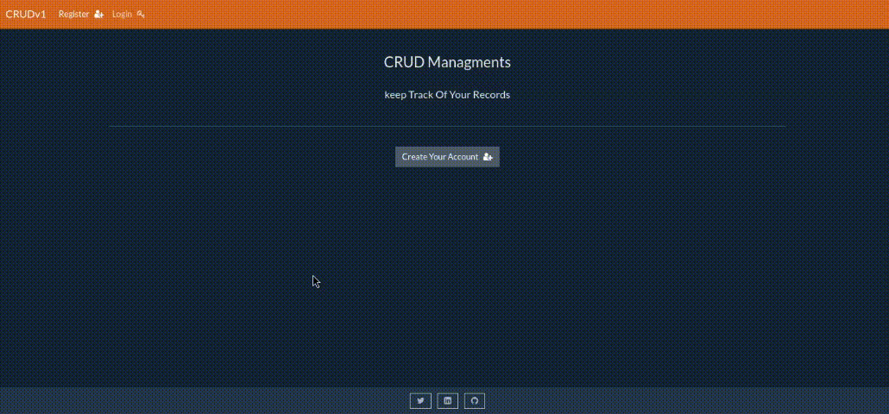

# Django CRUDv1 Project

## Overview

This Django CRUD project provides a simple web application for users to register an account, access a dashboard, and manage their personal information. Users can perform basic CRUD operations (Create, Read, Update, Delete) on their records stored in the database.

## Video



## Installation

1. Clone the repository:

   ```bash
   git clone https://github.com/badr-azeez/Django-CRUDv1.git
   cd Django-CRUDv1
   pip install -r requirements.txt
   python manage.py runserver

## Login
Note that the default credentials for the Django admin panel are:

-   **Username:** admin
-   **Password:** admin